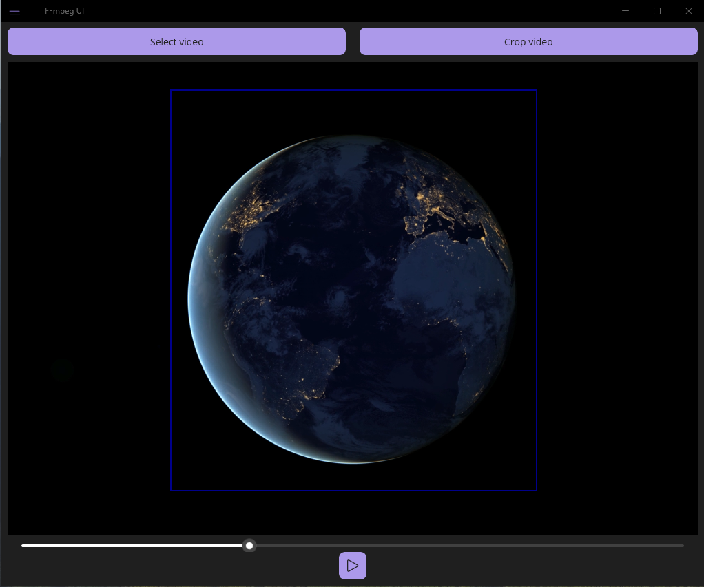

<div align="center">


</div>

# FFMpeg UI

### Video stabilizer for Windows/Android
## 💻📱 Screenshots

<div align="center">
<div>




</div>
</div>

## 📖 Features

- Stabilize videos.
- View videos preview.
- Generate merged video for result comparison.
- Crop videos by selected rectangle.
  
App use local instance of FFMpeg, you should add folder with ffmpeg to PATH or specify folder in app settings.  
Android use [Laerdal.FFmpeg.Full.Gpl](https://github.com/Laerdal/Laerdal.FFmpeg) ffmpeg implementation.

## Roadmap

- [x] Video frame size changing
- [ ] Adding text to video
  
## Build
- Visual Studio 2022

For packing app for Windows you can use this script:
```powershell
$certificateSubjectName = "CN={YOUR_CERTIFICATE_NAME}"
New-SelfSignedCertificate -Type Custom -Subject $certificateSubjectName  -KeyUsage DigitalSignature -FriendlyName "{YOUR_FRIENDLY_NAME}" -CertStoreLocation "Cert:\CurrentUser\My" -TextExtension @("2.5.29.37={text}1.3.6.1.5.5.7.3.3", "2.5.29.19={text}")

$cert = (Get-ChildItem cert:\CurrentUser\My   | where-object { $_.Subject -like "$certificateSubjectName" }  | Select-Object -First 1).Thumbprint

$env:Path += ";F:\Programs\vs\ide\Msbuild\Current\Bin" 
$env:Path += ";F:\Windows Kits\10\App Certification Kit"

$workSpace = "{YOUR_WORKSPACE}"
$winui_proj_name = "$workSpace\{PATH_TO_CSPROJ}.csproj"

msbuild $winui_proj_name /restore /t:Publish /p:TargetFramework=net9.0-windows10.0.19041  /p:configuration=Debug /p:GenerateAppxPackageOnBuild=true /p:AppxPackageSigningEnabled=true /p:PackageCertificateThumbprint=$cert
```

For Android apk:
```powershell
$workSpace = "{YOUR_WORKSPACE}"
$android_proj_name = "$workSpace\{PATH_TO_CSPROJ}.csproj"

keytool -genkey -v -keystore {KEYSTORE_NAME} -alias {ALIAS} -keyalg RSA -keysize 2048 -validity 3000

dotnet publish $android_proj_name -f:net9.0-android -c Release /p:AndroidSigningKeyPass={PWD} /p:AndroidSigningStorePass={PWD} /p:AndroidSigningKeyStore={KEYSTORE_NAME} /p:AndroidSigningKeyAlias={ALIAS} /p:AndroidKeyStore=True --artifacts-path "{PATH_FOR_ARTIFACTS}"
```
Change values with `{}` to your valid values.